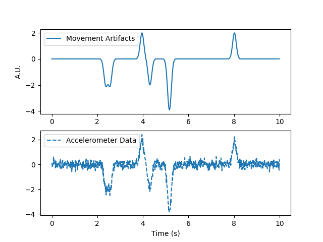

# Bayesian AR Model

Here, I simulate a pulsatile signal that is similar to what one may see in
diffuse optics signals at 100Hz. I also simulate two types of noise added to the signal.
One type of noise is implicit sensor noise sampled from a normal distribution:

The other kind of noise is exogeneous noise coming from movement. This
kind of noise is a Bernoulli process, &epsilon;a, which occurs with probability p. The
resulting Bernoulli process is convolved by a gaussian kernel to give it a
spread.

As a prior, we use accelerometer data -- simulated as the gaussian convolved bernouli process with noise added from a n
normal distribution.

The following image is an example of such movement that is added to the noise,
along with the accelerometer data.

The AR Model is then defined as such:

Pretty much, it's an infinite response filter whose inputs are gaussian noise +
 bernoulli process.

The objective of a Bayesian filter is to find the optimal posterior
distribution, i.e.

Considering we have prior knowledge of artifacts, we can marginalize this from
the likelihood function, turning the posterior into:

The likelihood can be described as a normal distribution with mean XW:

The artifacts can also be considered to come from a normal distribution of mean = 0

Finally, the weights of the AR model are also considered to be from a normal
distribution whose initial values are obtained from the OLS solution of the AR
model (w&#x0302;).

To obtain the optimal weights of the AR model given artifacts, we perform a Markov Chain Monte
Carlo and expectation maximization. The weights are sampled from a distribution with deviation
&sigma;w, whose initial values. If this candidate weight gives a more likely posterior
distribution than the old weights, we update the old weights with the candidate.
To avoid getting stuck in a mode, we anneal the variance that we sample the
weights from. Covariance of each distribution is calculated as a dot product
with the output of our model. i.e. (XW)(prior)T

Below, I show an example of results of this filter; Green vertical lines mark
where we sampled a motion artifact:

The top plot shows the bayesian filter (Red unfiltered; Green low pass filtered
[cutoff = 15Hz]) compared to the true signal (Blue). The middle
plot shows the bayesian filter compared to the observed signal with noise. The
third plot shows the bayesian filter compared to the AR model optimized via
ordinary least squares, i.e. log likelihood maximized for the distribution
p(Y|X,W,Artifacts), i.e. artifacts are not marginalized from the likelihood
estimate. We can clearly see that though we don't arrive back at the original
true signal, we definitely remove the motion artifact from the noisy
observation. A problem with this model, however, is that even though we remove
the motion artifacts, we at times regularize over real pulses.

Improvements to this algorithm can include mapping our feature set of the AR
model to a different feature space, e.g. using a gaussian radial basis function
to transform our AR features, or using a polynomial kernel transform. In other
words, treat the model as a nonlinear model. Furthermore, we can employ particle
filtering methods by sampling a set of candidate weights W and using a genetic
kind of algorithm to converge to the optimal W from the set of W. This would
greatly help in the case that we have a highly multimodal posterior probability
distribution function. Another way to improve this algorithm is updating the
posterior at each time step, similar to a Kalman filter or a real particle
filter, giving us something like an adaptive filter.

In the event that there is more noise observed that we have prior information
on, for example in an EEG signal we may get ocular or muscular signal mixed in, we can optimize the posterior
by further marginalizing the likelihood with prior information we have of ocular
or muscular signal.
