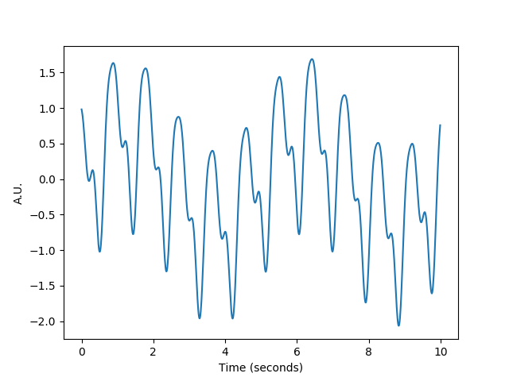
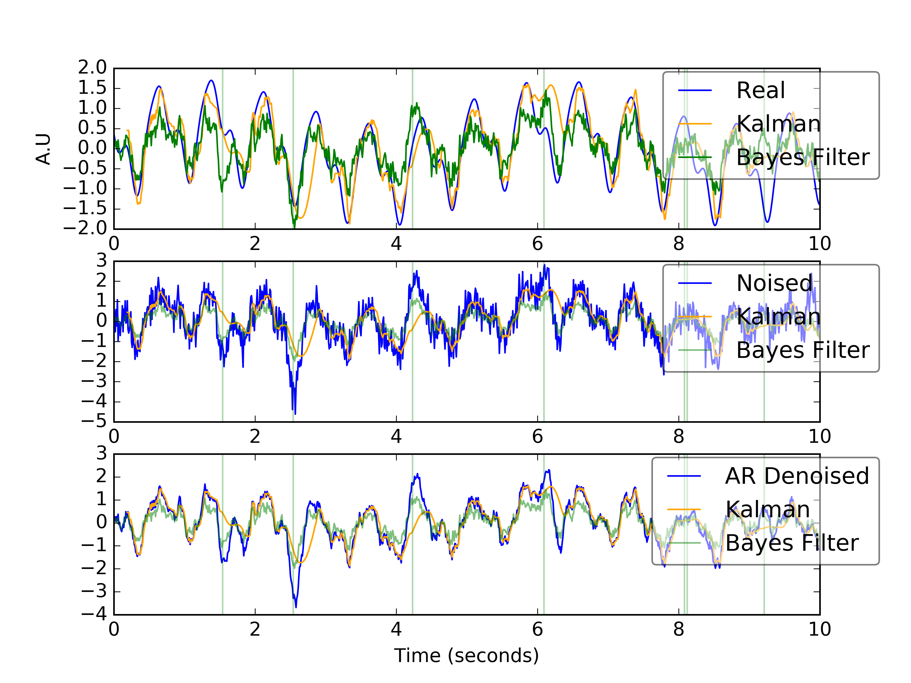

# Bayesian AR Model

[Simulations](#simulation)

[AR Model](#armodel)

[Bayesian Optimization of AR Model](#bayesopt)

[Kalman Filter](#kalman)

[Results](#results)

[Potential Improvements](#improvements)

## Simulation <a name="simulation"/>

Here, I simulate a pulsatile signal that is similar to what one may see in
diffuse optics signals at 100Hz. The equations that govern this pulse (i.e.
hemodynamic activity) is generally a control of the heart pumping blood through
the arteries. So the dominant frequency is the heart rate. Given Poiseuille
flow, we also have harmonics with lower amplitudes. Finally, there is a dampened
amplitude at the respiration rate, caused by the diaphragm expanding and
imputing negative pressure on the superior and inferior vena cava so that venous
return can occur.

This behavior can be illustrated using a Fourier series

And the typical signal can look like this:

I also simulate two types of noise added to the signal.
One type of noise is implicit sensor noise sampled from a normal distribution:

The other kind of noise is exogeneous noise coming from movement. This
kind of noise is a Bernoulli process, &epsilon;a, which occurs with probability p. The
resulting Bernoulli process is convolved by a gaussian kernel to give it a
spread.

As a prior, we use accelerometer data -- simulated as the gaussian convolved bernouli process with noise added from a n
normal distribution.

The following image is an example of such movement that is added to the noise,
along with the accelerometer data.

## AR Model <a name="armodel"/>

The AR Model is then defined as such:

Pretty much, it's an infinite response filter whose inputs are gaussian noise +
 bernoulli process.

## Bayesian Optimization of AR Model <a name="bayesopt"/>
The objective of a Bayesian filter is to find the optimal posterior
distribution, i.e.

Considering we have prior knowledge of artifacts, we can marginalize this from
the likelihood function, turning the posterior into:

The likelihood can be described as a normal distribution with mean XW:

The artifacts can also be considered to come from a normal distribution of mean = 0

Finally, the weights of the AR model are also considered to be from a normal
distribution whose initial values are obtained from the OLS solution of the AR
model (w&#x0302;).

To obtain the optimal weights of the AR model given artifacts, we perform a Markov Chain Monte
Carlo and expectation maximization. The weights are sampled from a distribution with deviation
&sigma;w. If this candidate weight gives a more likely posterior
distribution than the old weights, we update the old weights with the candidate.
To avoid getting stuck in a mode, we anneal the variance that we sample the
weights from. Covariance of each distribution is calculated as a dot product
with the output of our model. i.e. (XW)(prior)T assuming zero mean.

The beauty of the above model is that we can have a simple autoregressive filter
with prior knowledge encoded in the parameters that describe its dynamics.
Normal ordinary least squares does not have this knowledge encoded in it. This
allows for this model to be used later in the absence of any extra sensors like
an accelerometer.

## Kalman Filter <a name="kalman"/>

However, if we do have an accelerometer during the acquisition, we can in fact do
better than this Bayesian filter. To do this, we incorporate the accelerometer data
and the AR model into a Kalman filter. The observations we see contain noise
&epsilon;Q while the process, that being the AR model, contains noise that comes from
&epsilon;R. We want to use recursion to map the previous output of
the Kalman filter to what should be current output of the Kalman filter.
Essentially, it looks like this:

Where Fk is our AR model, and B is a mapping for our acceleration
information, i.e. control. This works to tell us the certainty of our model.

Once we find this prediction for our state, we will correct our prediction based
on what we finally observe, i.e. what our sensors measure.

where zk is information on how we update our model.

In practice, this would look like this. First we determine the covariance of our
AR model with our accelerometer sensor data. Assuming zero mean, it's the dot
product of our AR model outputs with the acceleration data
(XW)(accel)T. We use this to determine the probability of actually
having an artifact:

Where N is the order of our AR Model.

From there, we can determine the dynamics of the previous state to the next
state using this probability as a gain factor:

xt is used for the next time step of the Kalman filter until the end
of the time course.

## Results <a name="results"/>
Below, I show an example of results of these filter; Green vertical lines mark
where we sampled a motion artifact:

The top plot shows the bayesian filter (Green) and Kalman filter (Orange) compared to the true signal (Blue). The middle
plot shows the bayesian filter compared to the observed signal with noise. The
third plot shows the bayesian filter compared to the AR model optimized via
ordinary least squares, i.e. log likelihood maximized for the distribution
p(Y|X,W,Artifacts), i.e. artifacts are not marginalized from the likelihood
estimate. The Last plot shows the Kalman Filter's results.

We can clearly see that though we don't arrive back at the original
true signal, we definitely remove the motion artifact from the noisy
observation. A problem with this model, however, is that even though we remove
the motion artifacts, we at times regularize over real pulses.

Comparing the Bayesian filter to the Kalman filter, though, we see the Kalman
does a way better job of tracking the true output of the physiological signal.
Also, it does not suffer from the overregularization issue that the Bayesian
encoded AR model did.

## Potential Improvements <a name="improvements"/>

Improvements to this algorithm can include mapping our feature set of the AR
model to a different feature space, e.g. using a gaussian radial basis function
to transform our AR features, or using a polynomial kernel transform. In other
words, treat the model as a nonlinear model. Furthermore, we can employ particle
filtering methods by sampling a set of candidate weights W and using a genetic
kind of algorithm to converge to the optimal W from the set of W. This would
greatly help in the case that we have a highly multimodal posterior probability
distribution function. Another way to improve this algorithm is updating the
posterior at each time step like how our Kalman filter did, but instead of
Kalman filter we use a real particle filter, which has the beauty of not necessarily
assuming noise comes from a zero mean Gaussian, genetically converging to a
result.

In the event that there is more noise observed that we have prior information
on, for example in an EEG signal we may get ocular or muscular signal mixed in, we can optimize the posterior
by further marginalizing the likelihood with prior information we have of ocular
or muscular signal when using the Bayes optimized AR filter. The Kalman filter could also show utility with
more information going into the state transition matrix.
